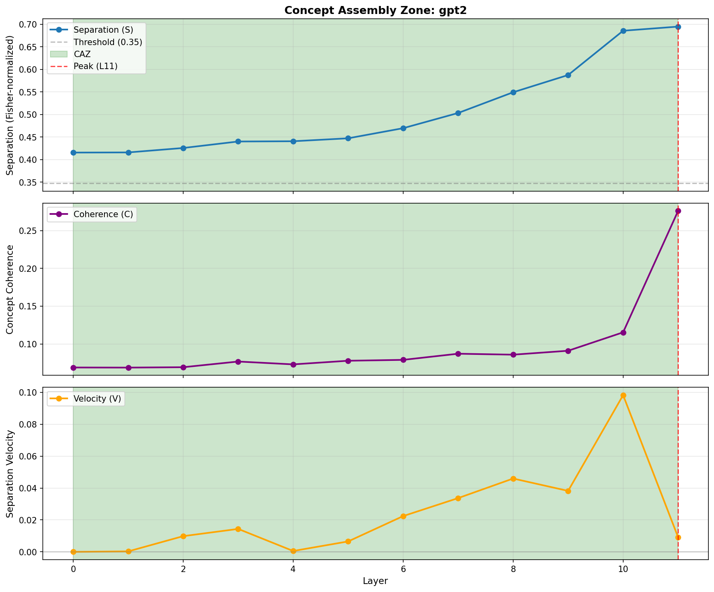
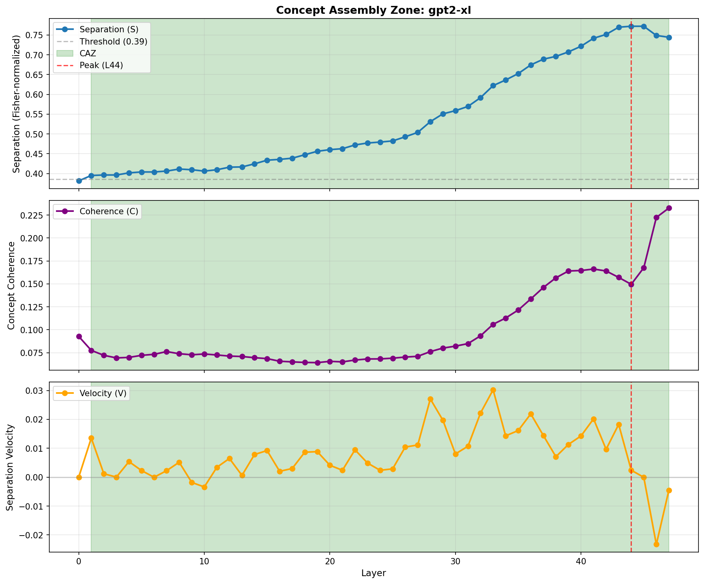
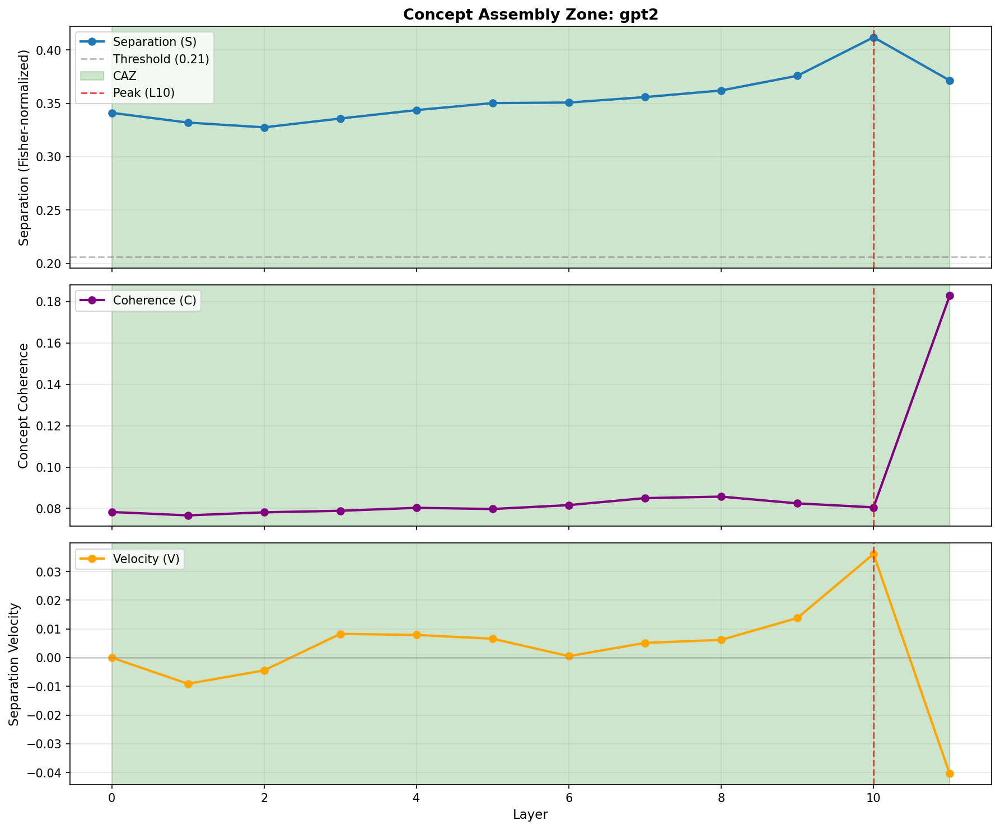
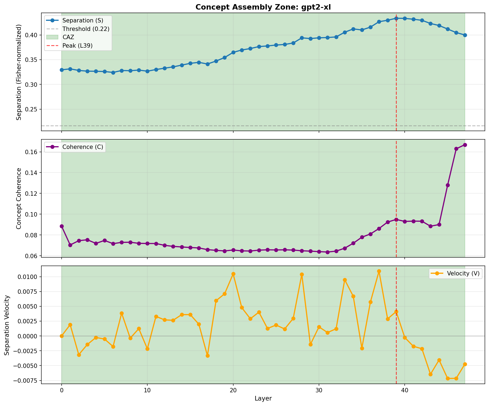
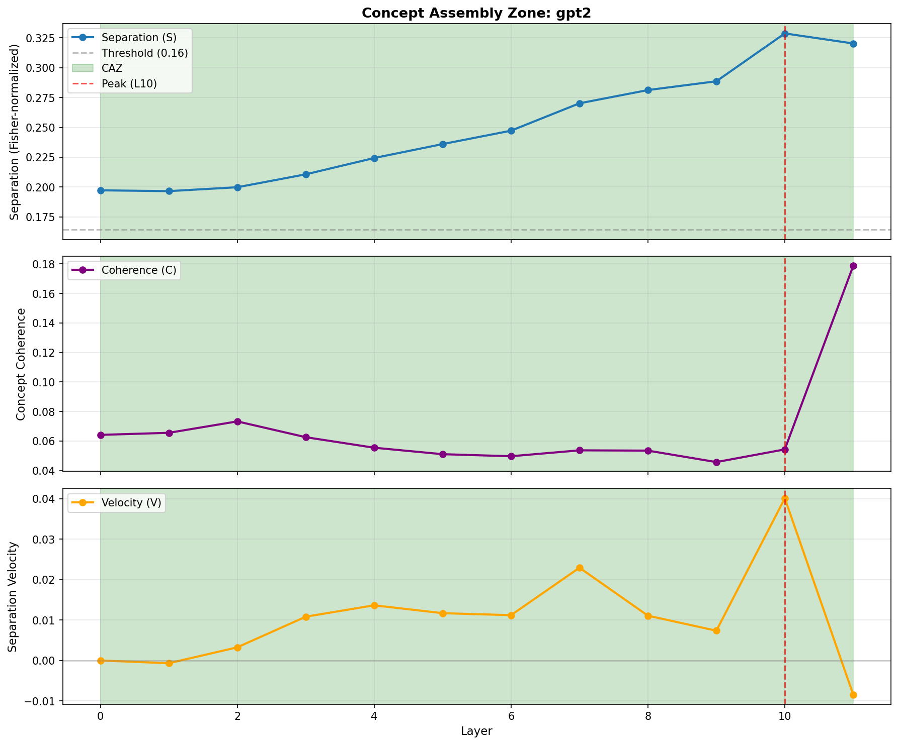
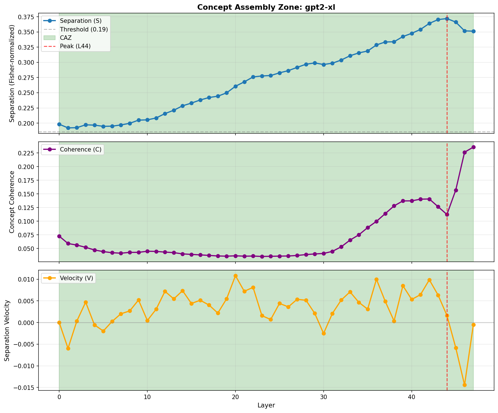

# Rosetta Manifold

**Empirical validation of the Concept Assembly Zone (CAZ) framework across transformer architectures**

*James Henry — March 2026*

---

Transformer language models develop geometric representations of semantic concepts across their depth. This project asks: *where* in the network does a concept like credibility, negation, or sentiment transition from vague syntactic probability into a stable, extractable direction — and is that location consistent across model architectures?

The answer is formalized as the **Concept Assembly Zone (CAZ)**: a contiguous sequence of middle-to-late layers where concept separation grows, coherence peaks, and ablation is most surgically effective. This repository contains the empirical pipeline that tests that framework.

The theoretical basis is in the companion paper: [**Concept Assembly Zone**](https://github.com/jamesrahenry/Concept_Assembly_Zone).

---

## Key Findings

Three concepts × two model scales (GPT-2 124M, GPT-2-XL 1.5B), run on consumer hardware (NVIDIA RTX 500 Ada, 4GB VRAM):

| Concept | Type | Peak layer (GPT-2) | Peak layer (GPT-2-XL) | Relative depth |
|---|---|---|---|---|
| Credibility | Epistemic | L10 / 12 | L44 / 48 | ~92% |
| Negation | Syntactic | L8 / 12 | L39 / 48 | ~81% |
| Sentiment | Affective | L9 / 12 | L44 / 48 | ~88–92% |

**Concepts assemble late.** In both model scales, peak separation occurs in the final 10–20% of model depth — not at the output layers, and not in mid-network.

**Concept type predicts assembly profile:**
- *Epistemic* (credibility): strong signal, late peak, highly entangled with general intelligence — hardest to ablate cleanly
- *Syntactic* (negation): moderate signal, earlier peak, orthogonal to other concepts — cleanest ablation
- *Affective* (sentiment): weaker signal, scale-dependent timing, orthogonal — improves markedly at larger scale

**Ablation works.** Orthogonal projection at the CAZ peak removes 100% of concept signal in GPT-2 scale models. KL divergence passes the <0.2 threshold for syntactic concepts at proxy scale; epistemic concepts require frontier scale for clean separation (expected — they're more entangled with general capability).

---

## Visualizations

**Comprehensive comparison — all 3 concepts × 2 models:**


**Credibility:**

| GPT-2 (124M) | GPT-2-XL (1.5B) |
|---|---|
|  |  |

**Negation:**

| GPT-2 (124M) | GPT-2-XL (1.5B) |
|---|---|
|  |  |

**Sentiment:**

| GPT-2 (124M) | GPT-2-XL (1.5B) |
|---|---|
|  |  |

Each figure shows three layer-wise metrics across all transformer blocks:
- **S(l)** — Separation: Fisher-normalized centroid distance between concept classes
- **C(l)** — Coherence: explained variance of the primary PCA component
- **v(l)** — Velocity: rate of change of separation (dS/dLayer)

---

## Pipeline

Three phases, each building on the last:

```
Phase 1  Dataset generation
         Contrastive pairs (credibility, negation, sentiment)
         N=100 pairs per concept, 4 domains each

Phase 2  Vector extraction
         DoM (Difference-of-Means) and LAT (Linear Artificial Tomography)
         Layer-wise S/C/v metrics via TransformerLens hooks
         CAZ boundary detection

Phase 3  Ablation validation
         Orthogonal projection to remove concept directions
         Validates: signal removal, KL divergence, cross-architecture transfer
         Mid-Stream Ablation Hypothesis: ablation at CAZ peak is most effective
```

---

## Repository Structure

```
Rosetta_Manifold/
├── src/                        Core pipeline
│   ├── generate_dataset.py       Phase 1: contrastive pair generation
│   ├── generate_negation_dataset.py
│   ├── generate_sentiment_dataset.py
│   ├── extract_vectors.py        Phase 2: DoM/LAT extraction + alignment
│   ├── extract_vectors_caz.py    Phase 2: layer-wise CAZ metrics
│   ├── analyze_caz.py            Phase 2: boundary detection + visualization
│   ├── ablate_vectors.py         Phase 3: orthogonal projection ablation
│   ├── ablate_caz.py             Phase 3: position-specific ablation test
│   ├── align_vectors.py          Cross-architecture Procrustes alignment
│   ├── compare_all_concepts.py   Multi-concept comparison figures
│   └── viz_dom_lat.py            DoM/LAT agreement visualization
├── data/                       Datasets
│   ├── credibility_pairs.jsonl
│   ├── negation_pairs.jsonl
│   └── sentiment_pairs.jsonl
├── tests/                      Test suite
│   ├── test_math_only.py         Dependency-free math tests (CI)
│   ├── test_extract_vectors.py
│   ├── test_ablate_vectors.py
│   ├── test_align_vectors.py
│   └── test_smoke.py
├── visualizations/             Key figures (committed)
├── results/                    Experimental outputs (gitignored large files)
├── scripts/                    Convenience runners
├── docs/                       Usage guides and specifications
│   ├── Spec 1 -- Credibility Contrastive Dataset.md
│   ├── Spec 2 -- Vector Extraction & Alignment Pipeline.md
│   ├── Spec 3 -- Heretic Optimization and Ablation.md
│   └── archive/                Session logs and interim reports
├── paper/                      Preliminary write-ups and resource proposals
└── experiments/                Jupyter notebooks
```

---

## Quickstart

```bash
git clone https://github.com/jamesrahenry/Rosetta_Manifold
cd Rosetta_Manifold
pip install -r requirements.txt

# Run the full CAZ pipeline on GPT-2
python src/extract_vectors_caz.py --model gpt2
python src/analyze_caz.py --model gpt2
python src/ablate_caz.py --model gpt2

# Or use the convenience script
bash scripts/run_caz_validation.sh

# Run all three concepts on both model scales
bash scripts/run_gpu_rerun.sh
```

**Requirements:** Python 3.11+, PyTorch with CUDA (fp16). GPT-2 models are downloaded automatically via HuggingFace and cached. All proxy-scale experiments run on a 4GB GPU.

For the full requirements including dataset generation dependencies (OpenAI/Ollama API, Opik tracking), see [`requirements.txt`](requirements.txt).

---

## Tests

```bash
# Math-only tests (no GPU, no model downloads — suitable for CI)
pytest tests/test_math_only.py tests/test_smoke.py -v

# Full test suite (requires torch)
pytest tests/ -v
```

Two known pre-existing test failures in `test_extract_vectors.py` (`test_dom_lat_agreement`, `test_full_pipeline_mock`) are caused by low-quality synthetic data in the test fixtures, not code bugs. All math tests pass.

---

## Status

| Component | Status |
|---|---|
| Phase 1: Dataset generation | Complete — 3 concepts, 100 pairs each |
| Phase 2: Vector extraction | Complete — DoM + LAT, all proxy models |
| Phase 2: CAZ metrics | Complete — S/C/v across all layers |
| Phase 3: Ablation | Complete — proxy scale validated |
| Proxy scale (GPT-2, GPT-Neo, OPT) | **Validated — 10 models** |
| Frontier scale (Llama 3 70B, Qwen 2.5 72B) | Pending compute |
| Publication | Preliminary paper in `paper/` |

Frontier-scale validation is the primary remaining blocker. The methodology and proxy results are complete.

---

## Related

- [**Concept Assembly Zone**](https://github.com/jamesrahenry/Concept_Assembly_Zone) — the theoretical framework paper this project tests
- [**Pop Goes the Easel**](https://github.com/jamesrahenry/pop_goes_the_easel) — a companion mechanistic interpretability study using CAZ reference data

---

## Theoretical Background

The pipeline uses established mechanistic interpretability methods:

- **Difference-of-Means (DoM)** — Arditi et al. (2024), *Refusal in Language Models Is Mediated by a Single Direction*
- **Linear Artificial Tomography (LAT)** — Zou et al. (2023), *Representation Engineering*
- **Orthogonal Procrustes alignment** — for cross-architecture vector comparison
- **TransformerLens** — Nanda et al., for residual stream hook access

The CAZ framework extends these by asking not just *whether* a concept has a geometric direction, but *when* across model depth it becomes stably extractable and surgically ablatable.

---

*jamesrahenry@henrynet.ca*
